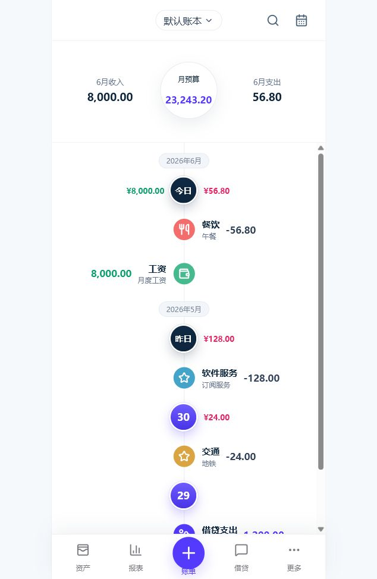
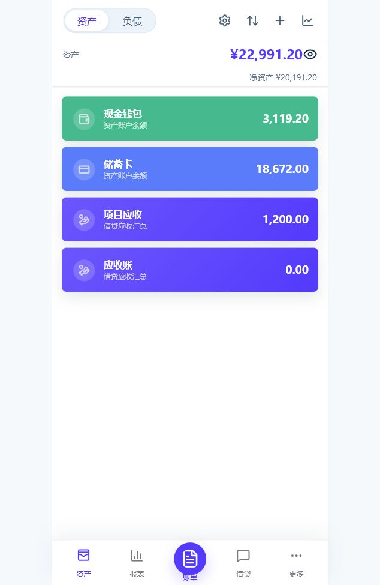
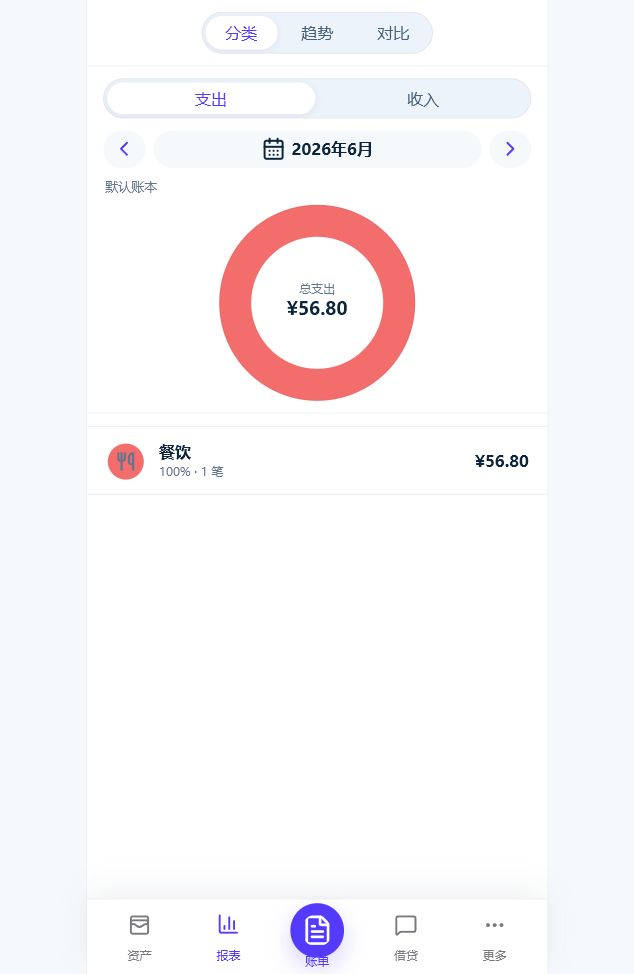
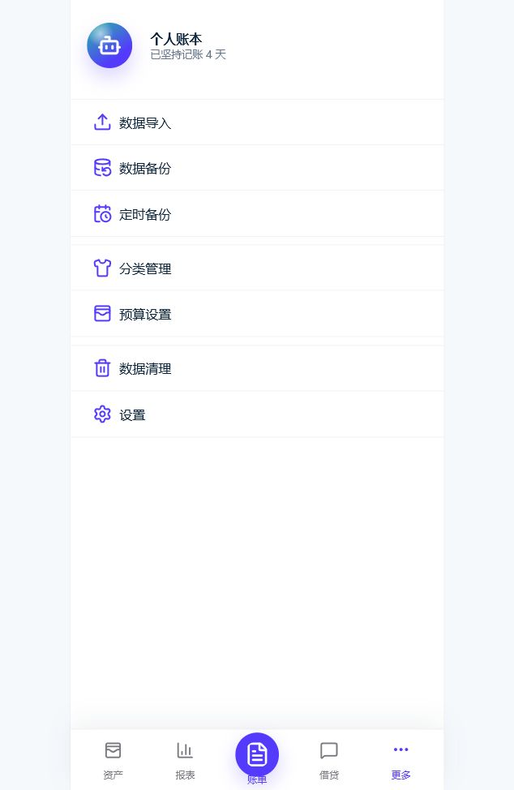

# 口袋记账风格个人记账系统

一个面向个人长期使用和群晖 NAS 私有部署的记账 PWA。项目目标是提供高效率的移动端记账体验，并把账本、备份、导入数据都保留在自己可控的环境中。

## 功能清单

- 登录保护：单用户登录、密码哈希、Cookie session、首次登录强制改密。
- 账单管理：收入、支出、转账、账单列表、详情、编辑、删除、复制。
- 账户资产：资产/负债账户、账户归档、是否计入资产、余额重算、资产概览。
- 分类与筛选：收支分类管理、排序、软删除、账单搜索和筛选。
- 报表统计：分类、趋势、对比、成员维度统计。
- 借贷管理：应收/应付、多个应收总账分组、收款/还款、追加、利息、结清和重开。
- 预算：月总预算、首页预算提示、预算设置入口。
- 数据导入：支持本地导出表格预览、清空导入、转账配对、导入警告。
- 备份恢复：手动备份、备份列表、下载、恢复前留档、从备份恢复。
- 私有部署：支持本机开发、本机 Docker 和群晖 Container Manager 部署。

## 技术栈

- 前端：React、TypeScript、Vite、PWA。
- 后端：Fastify、TypeScript、SQLite。
- 共享包：`packages/shared` 存放前后端共享类型和常量。
- 部署：Docker、Docker Compose、群晖 Container Manager。
- 文档：`docs` 存放开发、产品和部署说明。

## 快速启动

本机需要 Node.js 22+ 和 npm 11+。

```bash
npm install
cp .env.example .env
npm run dev:api
npm run dev:web
```

默认地址：

- 后端 API：`http://localhost:3000`
- 前端页面：`http://localhost:5173`

常用检查：

```bash
npm run typecheck
npm run build
npm audit --omit=dev
```

## 本机 Docker

构建镜像：

```bash
npm run docker:build
```

启动本机 Docker Compose：

```bash
npm run docker:config
npm run docker:up
```

默认访问 `http://localhost:3456`，数据挂载到项目根目录下的 `data`。本机 Docker 只用于开发或冒烟验证，不要把真实账本、导入表格、截图或 `.env` 提交到仓库。

## 群晖部署入口

推荐生产部署放在群晖独立目录中：

```text
/volume1/docker/pocket-ledger/
  app/
  config/.env
  data/app.db
  data/backups/
  data/uploads/
  docker-compose.yml
```

关键约定：

- 容器端口：`3000`
- NAS 默认访问端口：`3456`
- 容器数据目录：`/data`
- SQLite：`/data/app.db`
- 备份目录：`/data/backups`
- 上传目录：`/data/uploads`

详细步骤见 [docs/群晖部署说明.md](docs/群晖部署说明.md) 和 [docs/群晖NAS新手部署指南.md](docs/群晖NAS新手部署指南.md)。

## 数据安全提示

- 不要提交 `.env`、`data`、真实数据库、备份文件、本地导出表格、本地截图目录。
- 生产环境首次登录后立即修改初始密码。
- `SESSION_SECRET` 必须使用长随机字符串，并在生产环境中保持稳定。
- 群晖长期使用建议优先通过局域网、Tailscale、ZeroTier、WireGuard 或 VPN 访问。
- 不建议把服务直接暴露到公网；如必须公网访问，应配置 HTTPS、反向代理、强密码和访问控制。
- 大量导入、清空数据、恢复备份或升级镜像前，先创建备份。

## 运行截图

以下截图来自临时演示库，不包含真实导入表格、真实数据库或本机截图目录。

| 首页时间线 | 资产账户 |
| --- | --- |
|  |  |

| 借贷应收 | 报表统计 |
| --- | --- |
|  |  |

| 更多与数据工具 |
| --- |
|  |

## 常用文档

- [开发运行说明](docs/开发运行说明.md)
- [群晖部署说明](docs/群晖部署说明.md)
- [群晖 NAS 新手部署指南](docs/群晖NAS新手部署指南.md)
- [口袋记账 APP 定版文档](docs/口袋记账APP定版文档.md)
- [项目推进看板](docs/项目推进看板.md)
